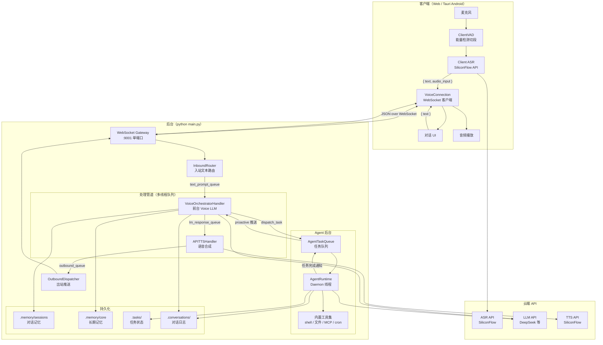
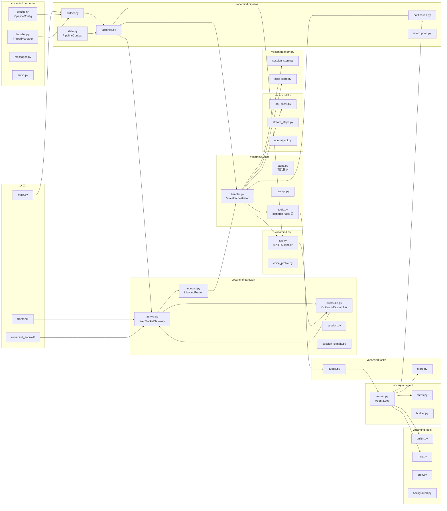
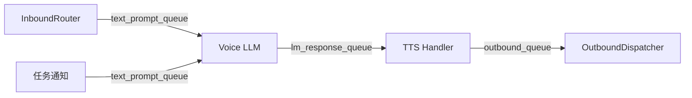
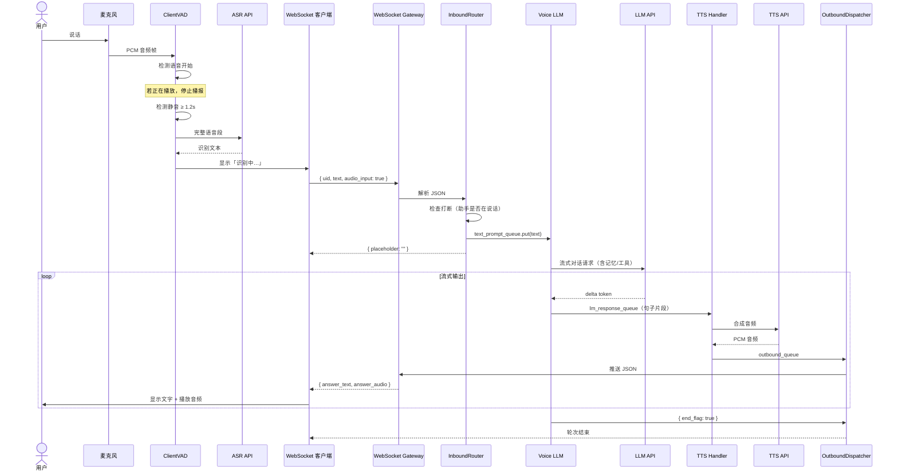
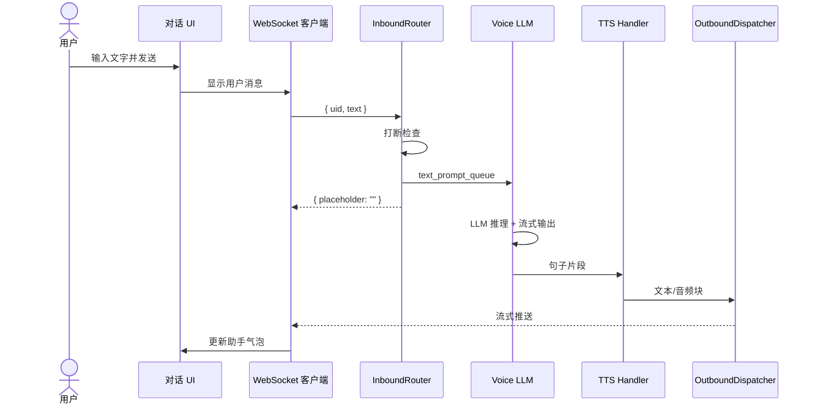
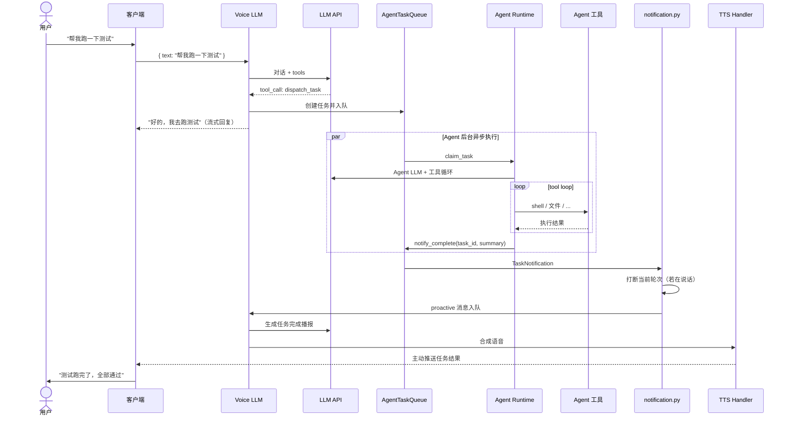
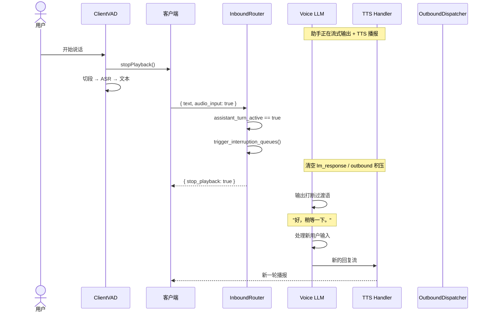
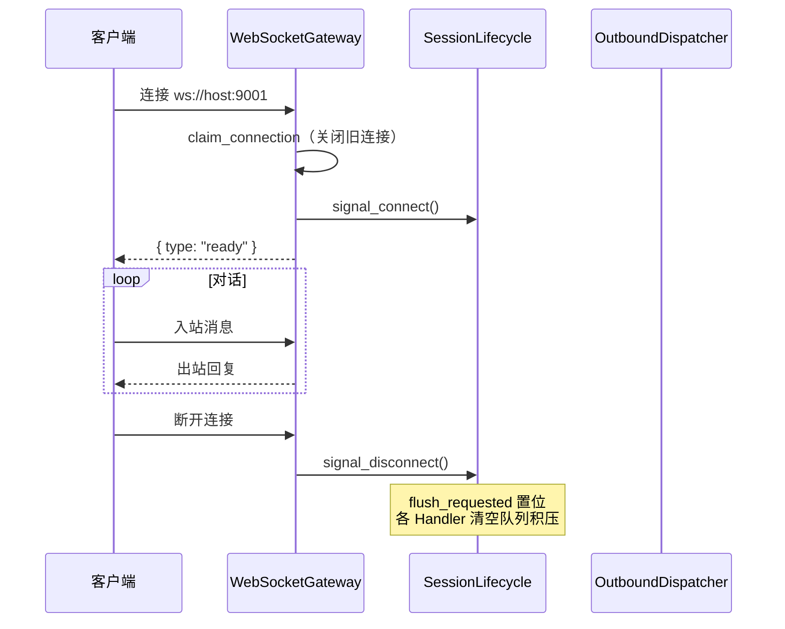
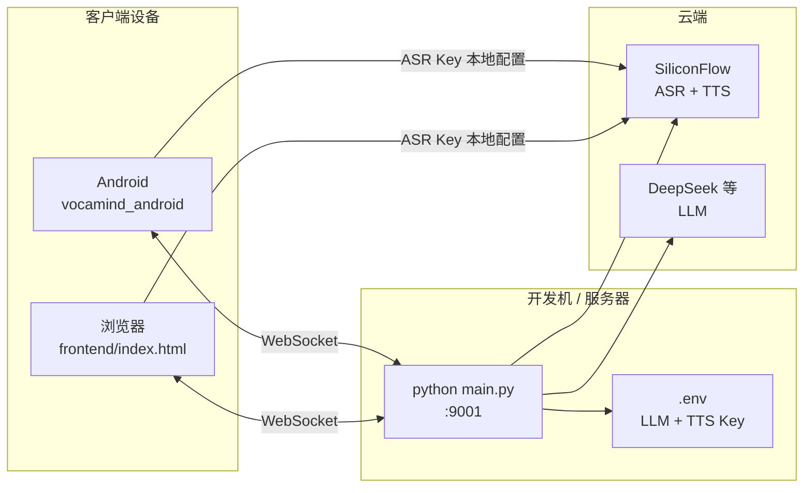
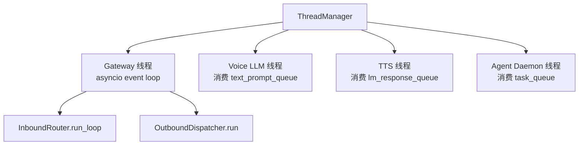

# VocaMind 架构文档

本文档描述 VocaMind 语音对话系统的整体架构、功能模块划分，以及核心业务流程的时序交互。

---

## 1. 系统架构图

VocaMind 采用**客户端语音处理 + 后台对话编排**的分层架构。语音识别（ASR）与语音活动检测（VAD）在客户端完成，后台专注于对话推理、语音合成与 Agent 任务执行。

### 架构要点

| 层级 | 职责 | 技术 |
|------|------|------|
| 客户端 | 采集音频、VAD 切段、ASR 转文字、播放 TTS、WebSocket 通信 | JS / Tauri WebView |
| 网关 | 单活跃连接管理、入站/出站 JSON 路由、打断信号 | `websockets` |
| Voice 管道 | 对话推理、工具调用（派发任务/查状态/记忆）、流式回复 | OpenAI 兼容 LLM |
| Agent 后台 | 异步执行复杂任务（文件、命令、MCP 等） | 独立 Daemon 线程 |
| 云端 | ASR（客户端）、LLM、TTS（后台） | SiliconFlow / DeepSeek 等 |

---

## 2. 功能模块图

按代码包划分的功能模块及其依赖关系。

### 模块职责一览

| 模块 | 核心类/文件 | 功能 |
|------|------------|------|
| `gateway` | `WebSocketGateway` | WebSocket 服务，管理单活跃客户端连接 |
| `gateway` | `InboundRouter` | 解析入站 JSON，写入 `text_prompt_queue` |
| `gateway` | `OutboundDispatcher` | 从 `outbound_queue` 取消息推送给客户端 |
| `voice` | `VoiceOrchestratorHandler` | 前台对话 LLM，可派发任务、维护记忆 |
| `voice` | `VOICE_TOOLS` | `dispatch_task` / `list_tasks` / `query_status` / `core_memory_*` |
| `agent` | `AgentRuntime` | 后台 Daemon，消费任务队列，执行完整 tool loop |
| `tasks` | `AgentTaskQueue` | 任务入队、完成通知、主动推送给 Voice |
| `memory` | `DialogueSession` | 当前会话短期对话记忆 |
| `memory` | `CoreMemoryStore` | 跨会话长期用户画像 |
| `tts` | `APITTSHandler` | 将 LLM 流式文本逐句合成音频 |
| `pipeline` | `PipelineContext` | 跨节点共享的队列与事件（打断、会话生命周期） |

### 管道队列数据流

---

## 3. 功能时序图

### 3.1 语音对话主流程

用户开麦说话，客户端完成 VAD + ASR 后发送文字，后台 LLM 推理并 TTS 播报。

### 3.2 文字输入流程

用户直接输入文字，跳过客户端 ASR。

### 3.3 Agent 任务派发与完成通知

用户请求后台执行任务（如跑测试、读写文件），Voice 派发任务，Agent 异步执行完成后主动通知用户。

### 3.4 用户打断流程

助手正在播报时，用户再次说话触发打断。

### 3.5 WebSocket 连接生命周期

---

## 4. WebSocket 协议摘要

### 4.1 客户端 → 后台（入站）

| 字段 | 类型 | 说明 |
|------|------|------|
| `uid` | string | 会话唯一标识（客户端生成 UUID） |
| `text` | string | 用户输入文字（ASR 结果或键盘输入） |
| `audio_input` | bool | `true` 表示来自语音输入，后台会回显 `question_text` |
| `is_playing` | string | `"true"` / `"false"`，告知后台客户端是否在播放音频 |
| `audio` | string | **已废弃**，后台会忽略并打日志 |

### 4.2 后台 → 客户端（出站）

| 字段 | 类型 | 说明 |
|------|------|------|
| `uid` | string | 会话标识 |
| `user_input_count` | int | 用户输入轮次序号 |
| `question_text` | string | 用户问题文本（语音输入时回显） |
| `answer_text` | string | 助手回复文本片段（流式追加） |
| `answer_audio` | string | Base64 编码的 PCM 音频（16kHz） |
| `end_flag` | bool | `true` 表示本轮对话结束 |
| `stop_playback` | bool | `true` 表示立即停止音频播放 |
| `proactive` | bool | `true` 表示后台主动推送（如任务完成通知） |
| `placeholder` | string | 空 ACK，表示入站消息已收到 |

---

## 5. 部署拓扑

| 组件 | 默认地址 | API Key 配置位置 |
|------|---------|-----------------|
| 后台 WebSocket | `ws://0.0.0.0:9001` | — |
| LLM | `.env` → `LLM_API_KEY` | 后台 |
| TTS | `.env` → `ASR_TTS_API_KEY` | 后台 |
| ASR | SiliconFlow transcriptions | **客户端**设置页 |
| Android 模拟器 WS | `ws://10.0.2.2:9001` | 客户端 |
| 真机 WS | `ws://<电脑局域网IP>:9001` | 客户端 |

---

## 6. 线程模型

后台启动后运行 4 个并发线程（`ThreadManager`）：

各线程通过 `queue.Queue` 传递消息，通过 `threading.Event` 协调打断与会话 flush。

---

*文档版本：与 `f05996a`（ASR 客户端化）同步*
